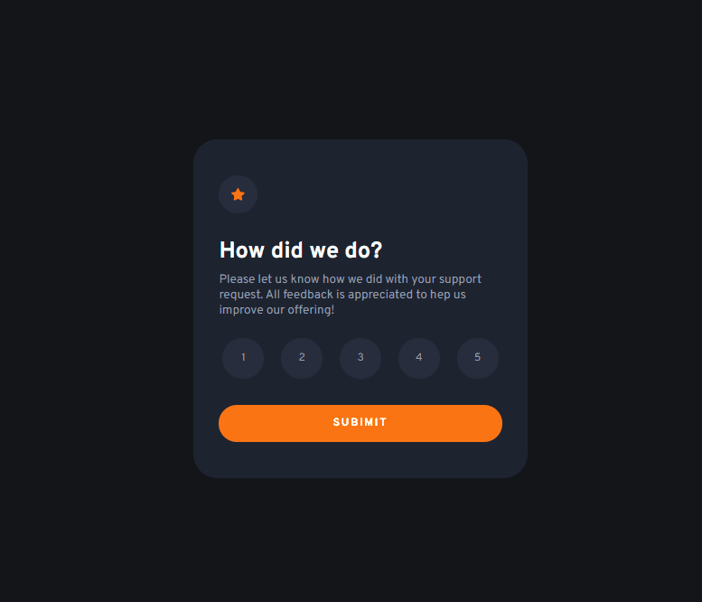

# Frontend Mentor - Interactive rating component solution

Esta é uma solução para o [Interactive rating component challenge on Frontend Mentor](https://www.frontendmentor.io/challenges/interactive-rating-component-koxpeBUmI). Os desafios do Frontend Mentor ajudam você a melhorar suas habilidades de codificação através da construção de projetos realistas.

## Overview

### O Desafio

Os usuários devem ser capazes de:

- Veja o layout ideal do aplicativo dependendo do tamanho da tela do dispositivo
- Veja os estados de foco para todos os elementos interativos na página
- Selecione e envie uma classificação numérica
- Veja o estado do cartão "Obrigado" após enviar uma classificação

### Screenshot

### Links

- Solution URL: [Add solution URL here](https://www.frontendmentor.io/solutions/interactiveratecomponent-AlINmgc32b)
- Live Site URL: [Add live site URL here](https://maikesoares.github.io/interactive_rate_component/)

### Construido com

- HTML5
- CSS
- JavaScript

I
